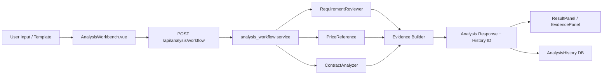

# 智慧采购原型 V2 设计文档（功能2-4）

## 1. 设计目标

在不大幅改造现有技术栈的前提下，实现：

1. 业务能力从“单点分析”升级为“链路化分析”。
2. 前端页面从“大单体视图”升级为“组件化与按需加载”。
3. 测试从“人工验证为主”升级为“自动回归可复用”。

---

## 2. 总体方案

### 2.1 后端架构演进

- 保持 FastAPI + Agent 结构不变。
- 新增“分析编排服务层”，统一调用 `RequirementReviewer`、`PriceReference`、`ContractAnalyzer`、`AgentCoordinator`。
- 新增历史记录存储模型，持久化输入、结果和证据链。

建议新增/调整文件：

- 新增：`/Users/ali/dev/cc-smart-procurement/backend/app/services/analysis_workflow.py`
- 新增：`/Users/ali/dev/cc-smart-procurement/backend/app/models/analysis_history.py`
- 新增：`/Users/ali/dev/cc-smart-procurement/backend/app/schemas/analysis.py`
- 新增：`/Users/ali/dev/cc-smart-procurement/backend/app/api/analysis.py`
- 修改：`/Users/ali/dev/cc-smart-procurement/backend/app/main.py`
- 修改：`/Users/ali/dev/cc-smart-procurement/backend/app/agents/agent_coordinator.py`

### 2.2 前端架构演进

- 保持 Vue3 + Router + Element Plus。
- 引入“分析工作台”容器页，整合输入、执行、结果、证据展示。
- 将巨型页面拆为子组件，按业务域组织。

建议新增/调整文件：

- 新增：`/Users/ali/dev/cc-smart-procurement/frontend/src/views/AnalysisWorkbench.vue`
- 新增：`/Users/ali/dev/cc-smart-procurement/frontend/src/components/analysis/InputPanel.vue`
- 新增：`/Users/ali/dev/cc-smart-procurement/frontend/src/components/analysis/ResultPanel.vue`
- 新增：`/Users/ali/dev/cc-smart-procurement/frontend/src/components/analysis/EvidencePanel.vue`
- 新增：`/Users/ali/dev/cc-smart-procurement/frontend/src/components/common/StateBlock.vue`
- 修改：`/Users/ali/dev/cc-smart-procurement/frontend/src/router/index.js`
- 修改：`/Users/ali/dev/cc-smart-procurement/frontend/src/api/index.js`

---

## 3. Phase A 业务功能设计

### 3.1 统一分析 API

- 接口：`POST /api/analysis/workflow`
- 输入：
  - `requirement_text`（可选）
  - `contract_text`（可选）
  - `product_keyword`（可选）
  - `budget`（可选）
  - `template_type`（可选）
- 输出：
  - `summary`
  - `requirement_result`
  - `price_result`
  - `contract_result`
  - `risk_score`
  - `evidence`（规则、价格来源、条款片段）
  - `history_id`

### 3.2 证据链结构

- `evidence.rules[]`: `rule_id`, `field`, `message`, `priority`
- `evidence.price_sources[]`: `product`, `source`, `date`, `price`
- `evidence.contract_clauses[]`: `clause_type`, `excerpt`, `risk_level`

### 3.3 历史记录模型

- 核心字段：
  - `id`, `user_id`, `template_type`
  - `input_payload`（JSON）
  - `result_payload`（JSON）
  - `risk_score`
  - `created_at`
- 能力：
  - 分页查询
  - 按时间/模板过滤
  - 以历史记录作为新分析输入

---

## 4. Phase B 体验与性能设计

### 4.1 页面拆分原则

- 容器负责：路由、状态、请求编排。
- 展示组件负责：渲染与交互事件抛出。
- 业务逻辑进入 composable：
  - `useAnalysisWorkflow`
  - `useDraftCache`
  - `useResultFormatter`

### 4.2 性能优化策略

- 路由懒加载：新工作台单独 chunk。
- 图表组件懒渲染：仅在结果页签激活时初始化。
- 大对象结果渲染分块：先摘要后详情。
- 避免重复请求：工作流结果前端缓存（短期会话级）。

### 4.3 统一状态体验

- `StateBlock` 统一处理：
  - loading
  - empty
  - error
  - unauthorized
- 前端接口层把错误码映射为可读提示。

---

## 5. Phase C 测试与工程化设计

### 5.1 后端测试

- 工具：`pytest` + `httpx` + FastAPI TestClient
- 覆盖层次：
  - API 入参校验
  - 服务编排逻辑
  - 历史记录 CRUD

建议目录：

- `backend/tests/api/test_analysis.py`
- `backend/tests/api/test_auth.py`
- `backend/tests/services/test_analysis_workflow.py`

### 5.2 前端测试

- 工具：`vitest` + `@vue/test-utils`
- 覆盖重点：
  - composables（输入校验、状态流转、格式化）
  - 组件（ResultPanel 与 EvidencePanel）

建议目录：

- `frontend/src/composables/__tests__/useAnalysisWorkflow.spec.js`
- `frontend/src/components/analysis/__tests__/ResultPanel.spec.js`

### 5.3 E2E 与 CI

- E2E：Playwright 三条冒烟链路。
- CI：`lint -> unit test -> build -> e2e(smoke)`。

---

## 6. 数据流（目标态）

---

## 7. 风险与回退

- 风险：新编排层导致接口响应变慢。
  - 对策：先串行实现，后续再做并发优化。
- 风险：页面拆分导致行为回归。
  - 对策：先补组件测试，再迁移。
- 风险：测试引入初期维护成本上升。
  - 对策：只覆盖高价值链路，避免过度测试。

---

## 8. 交付标准

1. 一个入口完成分析闭环，且结果可追溯。
2. 核心页面组件化完成并具备可维护性。
3. 测试与 CI 可稳定执行，能阻断明显回归。
